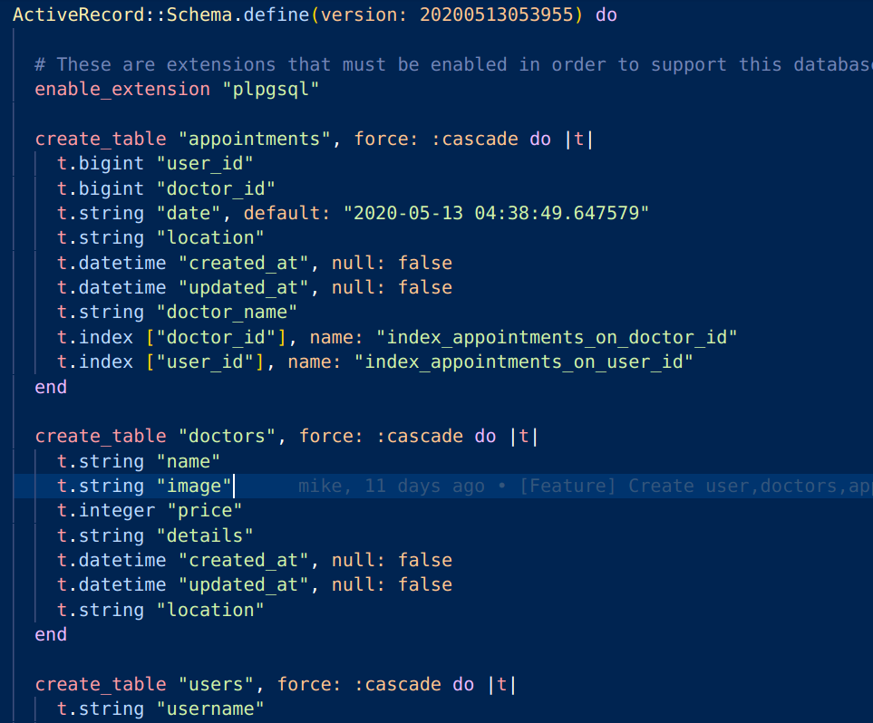

# Trixxcare-API

[![Contributors][contributors-shield]][contributors-url]
[![Forks][forks-shield]][forks-url]
[![Stargazers][stars-shield]][stars-url]
[![Issues][issues-shield]][issues-url]
[![MIT License][license-shield]][license-url]

 

  

  <h3 align="center">
	 Trixxcare API
  </h3>

  <h3 align="center">
	 Rails API-Deploy link - https://trixxcare.herokuapp.com
  </h3>

  <h3 align="center">
	 React Frontend link - https://trixxcare.netlify.app/
  </h3>

  

    This project implements an Rails-API setup to integrate with a react frontend app where patients can create appoitments with doctors
     
    <a href="https://github.com/mikenath223/trixxcare-api/blob/master/README.md"><strong>Explore the docs 📚</strong></a>
     
     
	  🖊️
    <a href="https://www.theodinproject.com/courses/ruby-on-rails/lessons/final-project">Assigment</a>
    🐛
    <a href="https://github.com/mikenath223/trixxcare-api/issues">Report Bug</a>
    🙏
    <a href="https://github.com/mikenath223/trixxcare-api/issues">Request Feature</a>
  

## Trixxcare-API

The main goal is to create an API backend for the front end react app.

# Validations

- Rubocop

# Get Started

* Make sure your PG cluster is running
* Run `bundle install` & `rails webpacker:install`
* Run `rails db:migrate` to migrate db
* Run tests with `bundle exec rspec <insert file_path here>`
* Run `rails db:seed` to generate seed data.
* Run `rails s` to start rails server
* Go to `localhost:3000` on a tool like Postman to make api-requests

# Features

* Users sign up and then sign in when registered.
* Appointments are created in relation to the doctors table as api-requests from the frontend.
* Postgres databases both for development and production 
* Associates several tables on the database using foreign keys:

* Database Schema

* Use of knock and jwt gem for API authentication
* Modify `routes.rb`
* Managed state with data on SqliteDB
* Tests made with [`RSpec`](https://relishapp.com/rspec/)

# Built With

* Passion for code.
* `ruby` v2.6.5
* `rails` v5.1+
* `vscode` with _Ruby_ and _Rubocop_ extensions
* Linux

# Author

* [Ukeje Michgolden](https://github.com/mikenath223)

# License

This project is licensed under the MIT License - see the [LICENSE.md](LICENSE.md) file for details 

<!-- ACKNOWLEDGEMENTS -->
## Acknowledgements
* [Microverse](https://www.microverse.org/)
* [The Odin Project](https://www.theodinproject.com/)

<!-- MARKDOWN LINKS & IMAGES -->
<!-- https://www.markdownguide.org/basic-syntax/#reference-style-links -->
[contributors-shield]: https://img.shields.io/github/contributors/mikenath223/trixxcare-api.svg?style=flat-square
[contributors-url]: https://github.com/mikenath223/trixxcare-api/graphs/contributors
[forks-shield]: https://img.shields.io/github/forks/mikenath223/trixxcare-api
[forks-url]: https://github.com/mikenath223/trixxcare-api/network/members
[stars-shield]: https://img.shields.io/github/stars/mikenath223/trixxcare-api
[stars-url]: https://github.com/mikenath223/trixxcare-api/stargazers
[issues-shield]: https://img.shields.io/github/issues/mikenath223/trixxcare-api
[issues-url]: https://github.com/mikenath223/trixxcare-api/issues
[license-shield]: https://img.shields.io/github/license/mikenath223/trixxcare-api
[license-url]: https://github.com/mikenath223/trixxcare-api/blob/master/LICENSE.txt
